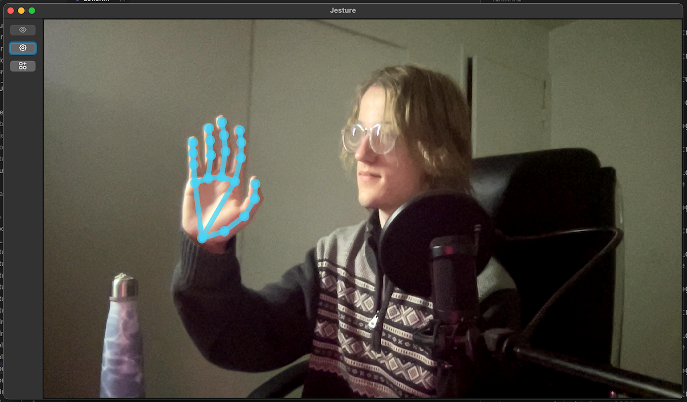

# Jesture UI
This is the home for the Jesture app. Jesture can recognize your hand gestures
using your webcam, and issue commands (like keyboard or mouse events) to your
computer after recognizing a gesture!

This repo is the base for the C++ frontend to link with our gesture recognition
pipeline. It is built using the Qt framework.

## Platforms
The frontend has been tested for Linux and macOS.

Currently, the pipeline cannot issue actions on macOS. You can run the frontend,
and you can see the program recognize your gestures, but it will not issue mouse
or keyboard events.

## Quick Start
Just run `bazel run -c opt //jesture` to start!

Note that for macOS, you need to install Qt6 and OpenCV using homebrew before
running the command above.

```
brew install qt@6 opencv
```

## Usage
Go to the gesture list tab, and press record to add a new gesture. In the
gesture list, you can also change the actions (keyboard events or mouse events)
which will be sent upon a gesture being recognized.

You can set the camera used in the settings tab. Try it with the new "continuity
camera" on macOS--you can reposition your iPhone as the camera to give the app a
better view of your hand gestures when you're far away or in a difficult
position.

Once you have set up the gestures you want, you can minimize the app and start
using your hands!

Here's a screenshot of the app.

